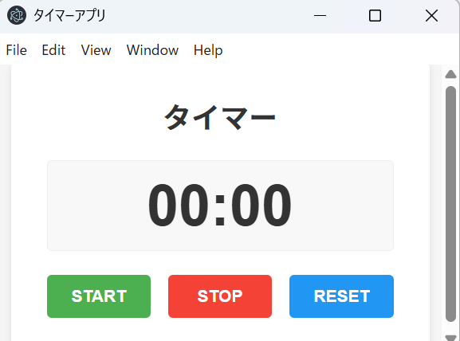

# Electron タイマーアプリ

シンプルなElectronベースのタイマーアプリケーションです。STARTボタンでタイマーを開始し、STOPボタンで一時停止、RESETボタンでタイマーをリセットできます。



## 機能

- シンプルで使いやすいインターフェース
- 分:秒形式のタイマー表示
- START/STOP/RESETボタンによる操作
- クロスプラットフォーム対応（Windows, macOS, Linux）

## 必要条件

- [Node.js](https://nodejs.org/) (v14.0.0以上推奨)
- npm (通常Node.jsと一緒にインストールされます)

## インストール方法

### Windowsの場合

1. [Node.js](https://nodejs.org/)をダウンロードしてインストールします
2. コマンドプロンプトまたはPowerShellを開きます
3. プロジェクトをクローンまたはダウンロードします
4. プロジェクトディレクトリに移動します:
   ```
   cd path\to\electron-sample
   ```
5. 依存関係をインストールします:
   ```
   npm install
   ```

### macOSの場合

1. [Node.js](https://nodejs.org/)をダウンロードしてインストールします
2. ターミナルを開きます
3. プロジェクトをクローンまたはダウンロードします
4. プロジェクトディレクトリに移動します:
   ```
   cd path/to/electron-sample
   ```
5. 依存関係をインストールします:
   ```
   npm install
   ```

## 使用方法

### アプリケーションの起動

プロジェクトディレクトリで以下のコマンドを実行します:

```
npm start
```

### タイマーの操作

- **START**: タイマーを開始します
- **STOP**: タイマーを一時停止します
- **RESET**: タイマーを00:00にリセットします

## ビルド方法

### 必要条件

- [Node.js](https://nodejs.org/) (v14.0.0以上推奨)
- npm (通常Node.jsと一緒にインストールされます)
- electron-builder (ビルド用)

### electron-builderのインストール

```
npm install --save-dev electron-builder
```

### ビルド手順

#### Windows向けビルド

Windowsプラットフォーム上で実行する場合:

```
npm run build:win
```

WSL/Linux環境からWindowsバイナリをビルドする場合は、wineが必要です:

```
# wineのインストール (Ubuntu/Debian)
sudo apt-get install -y wine

# ビルド実行
npm run build:win
```

#### macOS向けビルド

macOSプラットフォーム上で実行する場合:

```
npm run build:mac
```

#### Linux向けビルド

Linuxプラットフォーム上で実行する場合:

```
npm run build:linux
```

### ビルド成果物

ビルドが成功すると、`dist`ディレクトリに以下のファイルが生成されます:

- **Windows**: 
  - `dist/win-unpacked/Timer App.exe` - 実行可能ファイル
  - `dist/Timer App Setup 1.0.0.exe` - インストーラー (Windowsでビルドした場合)

- **macOS**: 
  - `dist/mac/Timer App.app` - macOSアプリケーション
  - `dist/Timer App-1.0.0.dmg` - ディスクイメージ

- **Linux**: 
  - `dist/linux-unpacked/electron-sample` - 実行可能ファイル
  - `dist/Timer App-1.0.0.AppImage` - AppImageファイル

### ビルドされたアプリケーションの実行方法

#### Windows
`Timer App.exe`をダブルクリックして実行します。

#### macOS
`Timer App.app`をダブルクリックして実行します。

#### Linux
AppImageファイルに実行権限を付与して実行します:
```
chmod +x "dist/Timer App-1.0.0.AppImage"
./dist/Timer\ App-1.0.0.AppImage
```

## 開発者向け情報

### プロジェクト構造

- `package.json` - プロジェクト設定とElectronの依存関係
- `main.js` - Electronのメインプロセス（ウィンドウ作成など）
- `index.html` - アプリケーションのUI
- `renderer.js` - タイマー機能の実装
- `styles.css` - アプリケーションのスタイル

### カスタマイズ

- ウィンドウサイズの変更: `main.js`の`BrowserWindow`設定を編集
- タイマーの表示形式の変更: `renderer.js`の`updateDisplay`関数を編集
- UIのスタイル変更: `styles.css`を編集

## トラブルシューティング

### よくある問題

1. **アプリが起動しない**
   - Node.jsとnpmが正しくインストールされているか確認
   - `npm install`を再実行して依存関係を更新

2. **「electron command not found」エラー**
   - グローバルにElectronをインストール: `npm install -g electron`
   - または: `npx electron .`を使用して起動

3. **ウィンドウが表示されない**
   - `main.js`のパスが正しいか確認
   - コンソールでエラーメッセージを確認

### Windows固有の問題

- **「EBUSY: resource busy or locked」エラー**
  - アンチウイルスソフトウェアが干渉している可能性があります
  - 一時的にアンチウイルスを無効にするか、例外を追加してください

### macOS固有の問題

- **「App is damaged and can't be opened」エラー**
  - ターミナルで以下を実行: `xattr -cr /path/to/YourApp.app`
  - または開発者として認証されたアプリのみを許可する設定を変更

## ライセンス

ISC

## 作者

このアプリケーションはElectronの学習目的で作成されました。
